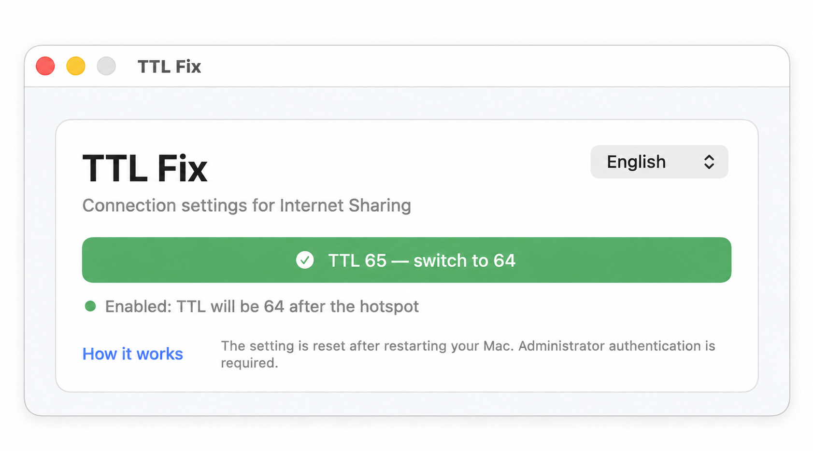

# TTL Fix

TTL Fix is a small app for people who share the internet from a Mac or Windows computer. It changes the network TTL setting with one button and clearly shows whether the change was successful.

## Download the app

Ready-to-use builds are created automatically for both platforms. Open the [Actions page](https://github.com/igorvorogushin/FixTTLforShareNetwork/actions), choose the latest successful build, then download the file from **Artifacts** at the bottom of the page:

- **TTL-Fix-macOS** — a ZIP archive containing the macOS app.
- **TTL-Fix-Windows** — the Windows `.exe` file.

On macOS, unzip the downloaded archive and move **TTL Fix.app** to Applications if you wish. The app is not signed by Apple yet, so macOS may ask you to confirm before the first launch.

On Windows, download the `.exe` and open it. Windows may show a security notice for the first launch because the app is not code-signed yet.

## How to use

Press the large TTL button and approve the administrator request. Green means the setting was successfully applied. Red means it was cancelled or an error occurred. The app will show a short message below the button if something goes wrong.

You can switch the interface between English and Russian in the app.

## Source code

The source code is stored in the `Mac` and `Windows` folders.

## Important

The app changes system network settings and asks for administrator permission. Use it only on devices and networks that you are allowed to configure.
